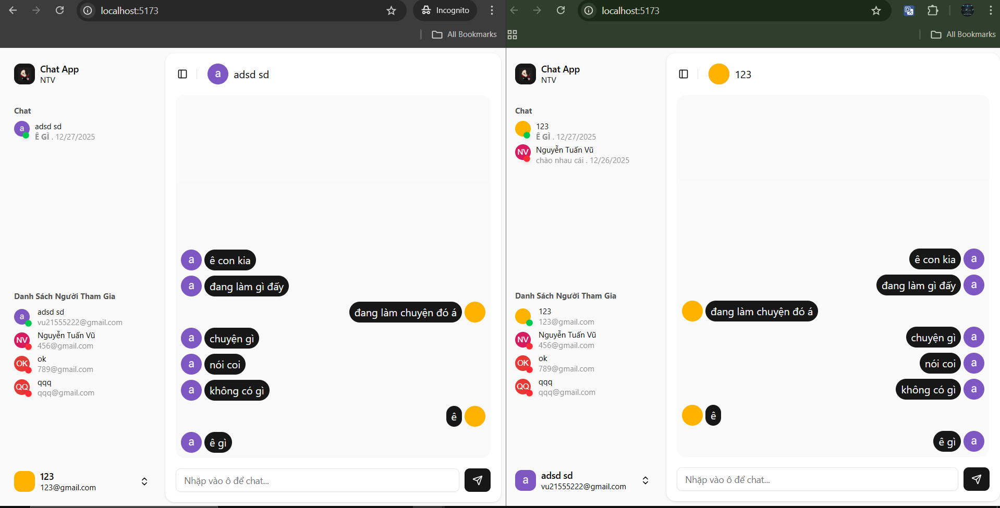

# 🚀 Chat App với SocketIO

## 📌 Giới thiệu

Dự án này là một ứng dụng chat realtime sử dụng **Socket.IO** trên nền tảng MERN Stack.Người dùng có thể đăng nhập, xem danh sách người tham gia online/offline, xem tin nhắn cuối, gửi/nhận tin nhắn theo thời gian thực.
Mục tiêu: Hiểu và nghiên cứu Socket.IO trong ứng dụng realtime - cấu trúc rõ ràng, tách service, middleware, controller đầy đủ.

---

## 🖼️ Demo / Screenshot

### **Demo**

https://chat-fe-pi.vercel.app

### **Screenshot**



---

## 🛠️ Tech Stack

### Frontend

- React + TypeScript
- Vite
- Zustand (quản lý state)
- Axios + interceptor
- React Router DOM
- RHF + Zod
- Socket.IO Client
- Tailwindcss
- Shadcn

### Backend

- Node.js + Express.js
- MongoDB + Mongoose
- JSON Web Token (JWT)
- Bcrypt / Crypto (hash token)
- Cookie HttpOnly / refresh token
- Google Auth
- Socket.IO Server

---

## 🧰 Công nghệ và khái niệm chính

- Vì dự án tập trung vào Socket.IO, các công nghệ khác chỉ mô tả ngắn gọn.

### **Socket.IO**

Toàn bộ realtime của dự án hoạt động dựa trên Socket.IO.

- Socket.IO là một thư viện JavaScript giúp thiết lập kênh giao tiếp hai chiều real-time giữa client và server. Nó dùng WebSocket làm nền tảng nhưng có thêm fallback, auto reconnect, room/namespaces và custom events cực kỳ hữu ích cho chat.
  Có hai phần:
- socket.io server (chạy Node.js)
- socket.io client (chạy trong trình duyệt React)

### **Node.js + Express.js**

- Backend tiếp nhận, xử lý, gửi phản hồi, cung cấp API xác thực.

### **MongoDB + Mongoose**

- Lưu thông tin user và refresh token.

---

## 🔄 Quy trình Socket.io xử lý realtime

**1. User Online / Offline realtime**
BE:

- Khi người dùng online, Socket.io lấy thông tin user từ middleware, tạo Socket ID tương ứng mỗi lần kết nối
- Khởi tạo danh sách người dùng online
- Kiểm tra user đã tồn tại trong danh sách này hay chưa, nếu chưa thì cho người dùng vào danh sách, lưu toàn bộ Socket ID vào danh sách tương ứng với user này
- Phát tín hiệu xuống cho Socket FE
  FE:
- Lắng nghe tín hiệu từ Socket BE xử lý hiển thị trạng thái online/offline

**2. Chat realtime theo conversation (Room)"**
Hiển thị tin nhắn cuối

- Khi người dùng online,Socket BE lấy toàn bộ danh sách Conversation tương ứng mà user đã tham gia, tiến hành tạo room , mỗi cuộc trò chuyện là 1 room(conversationId), cho Socket ID join vào toàn bộ những room này , hay nói cách khác join user này vào toàn bộ cuộc trò chuyện có mặt user trong đó.
- Khi người dùng chat, Socket.io sẽ vào room để phát tín hiệu cho toàn bộ Socket ID ở bên trong(chỉ có những Socket ID bên trong mới có thể lắng nghe)
- Socket FE lắng nghe tin hiệu(những user có Socket ID nằm trong room), cập nhật tin nhắn cuối và hiển thị cho những người trong conversation thấy(những Socket ID đã join vào room có conversationId tương ứng)

Hiển thị tin nhắn cửa sổ chat

- Khi người dùng online,Socket BE lấy toàn bộ danh sách Conversation tương ứng mà user đã tham gia, tiến hành tạo room , mỗi cuộc trò chuyện là 1 room(conversationId), cho Socket ID join vào toàn bộ những room này , hay nói cách khác join user này vào toàn bộ cuộc trò chuyện có mặt user trong đó.
- Mỗi lần người dụng chọn cuộc trò chuyện để chat, Socket ID của user sẽ được join vào phòng tương ứng. Khi người dùng chat, Socket.io sẽ phát tín hiệu cho room, những Socket ID trong room sẽ nhận được tín hiệu.
- Socket FE lắng nghe tin hiệu, cập nhật danh sách tin nhắn theo cuộc trò chuyện tương ứng và hiển thị cho toàn bộ người dùng trong cuộc trò chuyện thấy.

## 🚀 Cài đặt & Chạy dự án

### **1. Clone project**

```bash
git clone https://github.com/taikhoanchuafile/chat.git
cd chat
```

### **2.Backend setup**

```bash
cd backend
npm install
```

- Vào chat/backend tạo file **_.env_**

```bash
PORT=5001
# port của api backend (http://localhost:PORT)

GOOGLE_CLIENT_ID=<client_id của Google>
# client_id lấy từ https://console.cloud.google.com/ .VD:xxxxxxxxxxxx-ap44gugk6d5m56husl04bqkohgi0bd35.apps.googleusercontent.com

MONGODB_URL=<url csdl của mongodb>
# Key URL mongodb. Vd:mongodb+srv:....@cluster0.jerdkbp.mongodb.net/devGG?appName=Cluster0

FRONTEND_URL=http://localhost:5173
#port frontend React

ACCESS_TOKEN_SECRET=<key access tokeb>
# VD:c39acd4a56d3a428767a9a5bd7f37a6b9ea40d1278401aeef (chuỗi bất kỳ)
```

- Chạy backend(/chat/backend)

```base
npm run dev
```

### **3.Setup frontend**

```bash
cd ../frontend
npm install
```

- Vào chat/frontend tạo file **_.env_**

```base
VITE_GOOGLE_CLIENT_ID=<client_id>
# VD: xxxxxxxxxxxx-ap44gugk6d5m56husl04bqkohgi0bd35.apps.googleusercontent.com

VITE_BACKEND_URL=http://localhost:5001/api
# Nếu PORT Backend thay đổi: http://localhost:<PORT>/api

VITE_BACKEND_BASE_URL=http://localhost:5001
# Nếu PORT Backend thay đổi: http://localhost:<PORT>
```

- Chạy Frontend(/chat/frontend)

```base
npm run dev
```

- Ctrl + Chuột trái vào URL: _http://localhost:5173_ để mở dự án trên trình duyệt

## 📄 License

Dự án phát hành theo giấy phép [MIT](./LICENSE).
